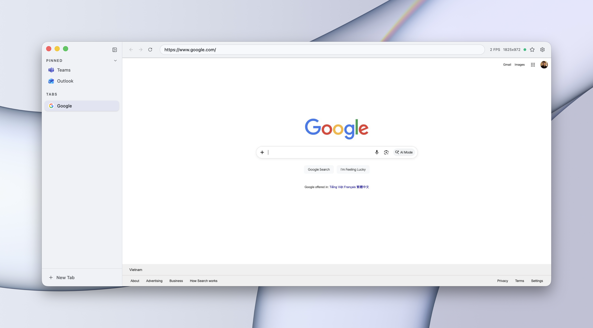

# CDP Browser

A lightweight Electron app that connects to a remote Chromium-based browser via [Chrome DevTools Protocol (CDP)](https://chromedevtools.github.io/devtools-protocol/), providing a native-like browsing experience with real-time screencast, tab management, and full input forwarding.



## Features

- **Real-time screencast** — JPEG frame stream from the remote browser rendered on a canvas
- **Full input forwarding** — mouse clicks, movement, scroll, keyboard events
- **Tab management** — create, close, switch, and drag-reorder tabs
- **Bookmarks** — pin pages, drag-reorder, middle-click to open in new tab
- **Arc-like UI** — collapsible sidebar, pill-shaped URL bar, shadcn/ui components
- **Light / Dark / System theme** — with smooth transitions
- **Navigation history** — back/forward buttons reflect actual browser history
- **Keyboard shortcuts** — Cmd+T, Cmd+W, Cmd+D, Cmd+L
- **Configurable** — remote CDP host/port via settings dialog
- **macOS native** — hidden title bar with traffic light integration

## Prerequisites

A Chromium-based browser running with remote debugging enabled:

```bash
# Chrome
google-chrome --remote-debugging-port=9222

# Microsoft Edge
msedge --remote-debugging-port=9222

# Chromium
chromium --remote-debugging-port=9222
```

The browser can be on the same machine or accessible over the network (e.g., via SSH tunnel).

## Installation

```bash
git clone https://github.com/duongdev/cdp-browser.git
cd cdp-browser
npm install
```

## Usage

### Development

```bash
npm run dev
```

Starts Vite dev server + Electron with hot reload.

### Production

```bash
npm start
```

Builds the renderer and launches Electron.

### Package for distribution

```bash
npm run dist        # Creates DMG + ZIP
npm run dist:dir    # Creates unpacked app (faster, for testing)
```

Output goes to `release/`.

## Configuration

On first launch, configure the remote CDP address via the settings icon (gear) in the toolbar:

- **Host**: IP or hostname of the machine running the remote browser (default: `localhost`)
- **Port**: CDP debugging port (default: `9222`)

Settings are persisted in the Electron userData directory.

## Keyboard Shortcuts

| Shortcut | Action |
|----------|--------|
| Cmd+T | New tab |
| Cmd+W | Close current tab |
| Cmd+Shift+T | Reopen closed tab |
| Ctrl+Tab | Next tab |
| Ctrl+Shift+Tab | Previous tab |
| Cmd+D | Bookmark current page |
| Cmd+L | Focus address bar |
| Cmd+Opt+L | Copy current URL |
| Cmd+R | Reload page |
| Cmd+[ | Go back |
| Cmd+] | Go forward |
| Cmd+S | Toggle sidebar |
| Cmd+, | Open settings |
| Cmd+F | Find in page |
| Escape | Unfocus address bar |

Trackpad swipe left/right is also supported for back/forward navigation.

## How It Works

```
[CDP Browser] --HTTP--> [Remote Browser :9222/json]     (tab list, create, close)
[CDP Browser] --WS----> [Remote Browser WS endpoint]   (screencast, input, navigation)
```

1. The app connects to the CDP HTTP API to list and manage tabs
2. When a tab is selected, it opens a WebSocket to that tab's debugger endpoint
3. `Page.startScreencast` streams JPEG frames which are drawn to a canvas
4. Mouse and keyboard events are mapped and forwarded via `Input.dispatch*` methods
5. Navigation events update the URL bar and tab list in real-time

## Tech Stack

- [Electron](https://www.electronjs.org/) — desktop runtime
- [React 19](https://react.dev/) — UI framework
- [Tailwind CSS 4](https://tailwindcss.com/) — styling
- [shadcn/ui](https://ui.shadcn.com/) — component library
- [dnd-kit](https://dndkit.com/) — drag and drop
- [Vite](https://vite.dev/) — build tool
- [Lucide](https://lucide.dev/) — icons

## License

MIT
